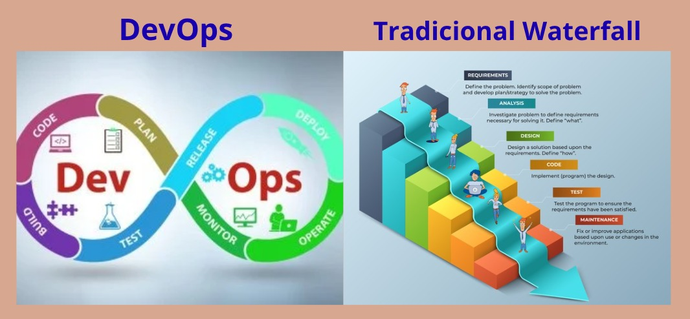

# Actividad 1: Introducción a DevOps y DevSecOps  
**Nombre:** Harold German
**Fecha:** 30/08/2025 
**Tiempo invertido:** [hh:mm]  

## Contexto del entorno
Usé el entorno de GNU/Linux - Ubuntu basado en Debian GNU/Linux, ya que este sistema operativo es más estable, seguro y ampliamente usado en entornos de desarrollo profesional.
Además, cuenta con una gran comunidad de soporte, facilidad para instalar librerías mediante apt y mejor compatibilidad con herramientas de DevOps, servidores y entornos de programación.

---

## 4.1 DevOps vs. Cascada tradicional
  

- **Explicación:**  
Explica por qué DevOps acelera y reduce riesgo en software para la nube frente a cascada (feedback continuo, pequeños lotes, automatización).

DevOps acelera ya que hace entregas pequeñas y frecuentes, con *deploys* casi diarios, a comparación con Cascada donde recién al final se tiene la aplicación completa.  
Esto reduce el riesgo de errores y permite solucionarlos más rápido.  

### 🔹 Feedback
- **Cascada:** Se realizan los *testing* al final del proyecto, lo que retrasa la entrega y puede causar costos grandes e innecesarios.  
- **DevOps:** Las entregas parciales hacen que el *feedback* sea casi inmediato y gracias a eso los errores se corrigen rápidamente.  

### 🔹 Pequeños Lotes
- **Cascada:** Se entregan *releases* casi al terminar el proyecto, por lo que si algo falla todo el proyecto puede verse comprometido.  
- **DevOps:** Gracias a los *deploys* frecuentes, se pueden detectar errores en etapas tempranas, lo que reduce riesgos.  

### 🔹 Automatización
- **Cascada:** Los procesos suelen ser manuales, por lo que están expuestos a errores humanos.  
- **DevOps:** Se usan **pipelines (CI/CD)** donde se realiza *build, test y deploy* automáticamente, lo que resulta más rápido y eficiente.  

- **Pregunta retadora:**  
señala un contexto real donde un enfoque cercano a cascada sigue siendo razonable (por ejemplo, sistemas con certificaciones regulatorias estrictas o fuerte acoplamiento hardware).
Expón dos criterios verificables y los trade-offs (velocidad vs. conformidad/seguridad).

### 🔹 Contexto: Sistemas en la industria farmacéutica o médica  
En entornos como la **industria farmacéutica o médica**, los sistemas de software deben cumplir con normativas estrictas de certificación, como las de la **FDA** o **EMA**.
Estos sistemas necesitan un enfoque de desarrollo tradicional similar a cascada debido a la alta necesidad de documentación y verificación en cada fase del proceso de desarrollo.

#### Criterios verificables:

1. **Cumplimiento normativo (Certificaciones regulatorias)**  
   - **Trade-off**: **Velocidad vs. Conformidad**. El enfoque cascada permite una planificación detallada y la documentación completa, que es necesaria para cumplir con los requisitos
      regulatorios, aunque esto retrase el desarrollo.

2. **Estabilidad y fiabilidad del sistema**  
   - **Trade-off**: **Seguridad vs. Velocidad**. La naturaleza secuencial de cascada ayuda a asegurar que cada fase del desarrollo se validé de manera exhaustiva, asegurando un sistema más
     estable y fiable, pero esto también implica un ciclo de desarrollo más largo.

Este enfoque es razonable para proyectos donde la **seguridad** y **conformidad** son prioritarias sobre la **velocidad** del desarrollo.

---

